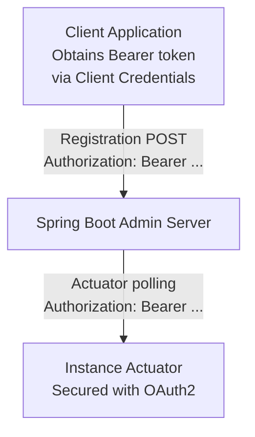

# OAuth2 Client Credentials

Use the OAuth2 Client Credentials flow for machine-to-machine authentication between Spring Boot Admin components.

## Overview

The OAuth2 Client Credentials flow is the standard pattern for machine-to-machine (M2M) authentication where no
user session is involved. Spring Boot Admin supports it in two communication paths:

1. **Client → Server**: when a client application registers itself on the SBA server
2. **Server → Instances**: when the SBA server polls actuator endpoints on registered instances

This support is **opt-in** and requires `spring-security-oauth2-client` on the classpath. Existing HTTP Basic Auth
behaviour is unchanged.



---

## Client Side — Registering with OAuth2

Use this when the SBA server requires a Bearer token for its `/instances` registration endpoint.

### Dependencies

Add `spring-boot-starter-oauth2-client` to your client application:

**Maven**:

```xml
<dependency>
    <groupId>org.springframework.boot</groupId>
    <artifactId>spring-boot-starter-oauth2-client</artifactId>
</dependency>
```

**Gradle**:

```gradle
implementation 'org.springframework.boot:spring-boot-starter-oauth2-client'
```

### Configuration

The registration ID is resolved in this priority order:

1. **Instance metadata** key `oauth2.registration-id` (or kebab-case `oauth2-registration-id`) — per-instance override,
   same keys the server uses when polling actuator endpoints
2. **`spring.boot.admin.client.oauth2-registration-id`** — default that applies to all registrations;
   allows zero-metadata configuration

**Minimal setup (default property only):**

```yaml title="application.yml"
spring:
  security:
    oauth2:
      client:
        registration:
          sba-client:
            authorization-grant-type: client_credentials
            client-id: ${OAUTH2_CLIENT_ID}
            client-secret: ${OAUTH2_CLIENT_SECRET}
        provider:
          sba-client:
            token-uri: https://your-authorization-server/oauth2/token

  boot:
    admin:
      client:
        url: http://admin-server:8080
        # Works out of the box — no metadata entry required
        oauth2-registration-id: sba-client
```

**Per-instance override via metadata** (takes precedence over `oauth2-registration-id`):

```yaml title="application.yml"
spring:
  boot:
    admin:
      client:
        url: http://admin-server:8080
        oauth2-registration-id: default-client   # fallback
        instance:
          metadata:
            oauth2.registration-id: override-client  # overrides the default for this instance
```

:::note
When an OAuth2 registration ID is resolved (from either source), Basic Auth (`username` / `password`) is ignored
for the registration request. The two mechanisms are mutually exclusive.
:::

### How It Works

When `spring-security-oauth2-client` is on the classpath and an `OAuth2AuthorizedClientManager` bean is present in
the context, Spring Boot Admin auto-configures an `OAuth2ClientHttpRequestInterceptor` on the registration
`RestClient`. The interceptor resolves the registration ID (metadata first, then `oauth2-registration-id`), obtains
(and caches/refreshes) a Bearer token from your Authorization Server using the configured `client_credentials`
grant, then attaches it as an `Authorization: Bearer <token>` header on every registration request.

---

## Server Side — Polling Instances with OAuth2

Use this when registered instances expose actuator endpoints that are secured with OAuth2 Bearer token
authentication.

### Dependencies

Add `spring-boot-starter-oauth2-client` to your SBA server:

**Maven**:

```xml
<dependency>
    <groupId>org.springframework.boot</groupId>
    <artifactId>spring-boot-starter-oauth2-client</artifactId>
</dependency>
```

**Gradle**:

```gradle
implementation 'org.springframework.boot:spring-boot-starter-oauth2-client'
```

### Configuration

```yaml title="application.yml"
spring:
  security:
    oauth2:
      client:
        registration:
          instances-client:
            authorization-grant-type: client_credentials
            client-id: ${OAUTH2_CLIENT_ID}
            client-secret: ${OAUTH2_CLIENT_SECRET}
        provider:
          instances-client:
            token-uri: https://your-authorization-server/oauth2/token

  boot:
    admin:
      instance-auth:
        oauth2:
          # Default registration ID for all instances
          default-registration-id: instances-client
          # Per-service override (key = spring.application.name of the registered service)
          service-map:
            payment-service: payment-service-client
            inventory-service: inventory-service-client
```

:::note
When a `ReactiveOAuth2AuthorizedClientManager` bean is present, the OAuth2 headers provider is registered alongside
the existing `BasicAuthHttpHeaderProvider`. If both are active, both sets of headers are merged — configure only one
mechanism per environment to avoid conflicts.
:::

### Registration ID Resolution Order

The registration ID is resolved in the following priority order (highest first):

1. **Instance metadata** key `oauth2.registration-id` (or `oauth2-registration-id`) — the client
   instance sets its own registration ID in its metadata:

   ```yaml title="client application.yml"
   spring:
     boot:
       admin:
         client:
           instance:
             metadata:
               oauth2.registration-id: my-instance-client
   ```

2. **`service-map`** — server-side per-service override keyed by `spring.application.name`
3. **`default-registration-id`** — server-side fallback for all instances

If none of the above yields a registration ID for an instance, no OAuth2 header is added for that instance.

---

## Combined Example

Below is a minimal end-to-end example where both client registration and instance polling use OAuth2.
Note that `oauth2-registration-id` on the client covers the registration request, and the same value passed
in metadata is picked up by the server when polling that instance's actuators:

### Client (`payment-service`)

```yaml title="application.yml"
spring:
  application:
    name: payment-service

  security:
    oauth2:
      client:
        registration:
          sba-registration:
            authorization-grant-type: client_credentials
            client-id: payment-service
            client-secret: ${CLIENT_SECRET}
        provider:
          sba-registration:
            token-uri: https://auth.company.com/oauth2/token

  boot:
    admin:
      client:
        url: https://admin.company.com
        # Default: used when authenticating against the SBA server
        oauth2-registration-id: sba-registration
        instance:
          metadata:
            # Also passed to the server so it knows which registration to use
            # when polling this instance's actuator endpoints
            oauth2.registration-id: sba-registration
```

### Server (`spring-boot-admin`)

```yaml title="application.yml"
spring:
  security:
    oauth2:
      client:
        registration:
          actuator-client:
            authorization-grant-type: client_credentials
            client-id: sba-server
            client-secret: ${CLIENT_SECRET}
        provider:
          actuator-client:
            token-uri: https://auth.company.com/oauth2/token

  boot:
    admin:
      instance-auth:
        oauth2:
          default-registration-id: actuator-client
```

---

## See Also

- [Actuator Security](./20-actuator-security.md) — HTTP Basic Auth for actuator endpoints
- [Server Authentication](./10-server-authentication.md) — Secure the Admin Server UI and API
